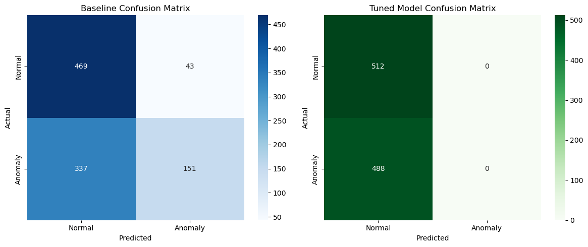
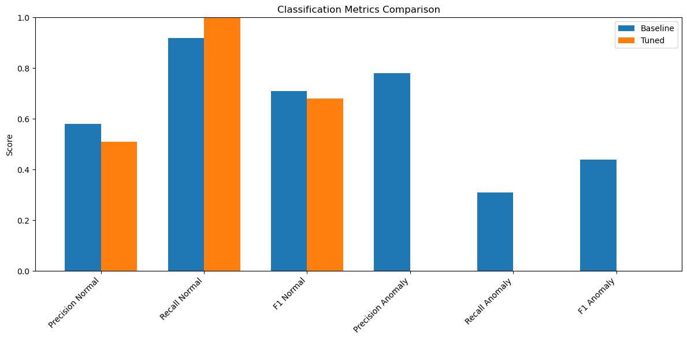
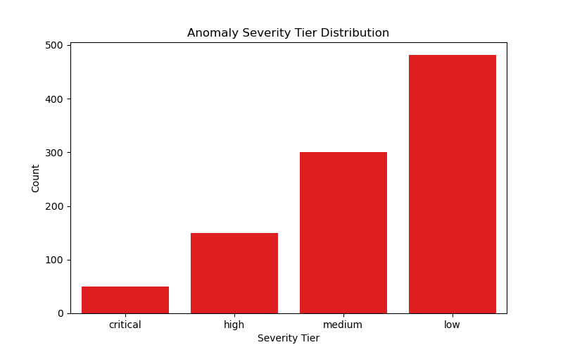

# CloudWatch Sentinel

## Overview

CloudWatch Sentinel is a machine learning-based anomaly detection system designed to identify malicious events within AWS CloudWatch logs using the Isolation Forest algorithm. Leveraging a dataset of over **5,000 AWS event records** with **5,035 features**, this project builds a robust pipeline from data preprocessing to deployment-ready model scoring.

---

## Key Features

- Preprocessing with null handling and one-hot encoding  
- Stratified train/test splitting to preserve class distributions  
- Baseline and hyperparameter-tuned Isolation Forest models for anomaly detection  
- Custom anomaly threshold based on percentile anomaly scores  
- Severity scoring and classification into four tiers: **Critical**, **High**, **Medium**, and **Low**  
- Model evaluation via confusion matrix, classification report, and accuracy metrics  
- Model serialization and ready-to-deploy AWS Lambda inference handler  

---

## Quantifiable Results

| Metric                | Baseline Model  | Tuned Model     |
|-----------------------|-----------------|-----------------|
| Dataset Size          | 5,000+ events   | 5,000+ events   |
| Train/Test Split       | 80% / 20%       | 80% / 20%       |
| Training Labels (Normal / Anomaly) | 2048 / 1952      | Same            |
| Testing Labels (Normal / Anomaly)  | 512 / 488        | Same            |
| Accuracy               | 62%             | 51.2%           |
| Precision (Normal)     | 58%             | 51%             |
| Recall (Normal)        | 92%             | 100%            |
| F1 Score (Normal)      | 71%             | 68%             |
| Precision (Anomaly)    | 78%             | 0%              |
| Recall (Anomaly)       | 31%             | 0%              |
| F1 Score (Anomaly)     | 44%             | 0%              |

*The baseline model demonstrates better anomaly detection performance, while the tuned model maximizes normal event recall.*

---

## Visualizations

### Confusion Matrices Comparison

### Classification Metrics Comparison

### Anomaly Severity Tier Distribution

---

## How to Use

1. **Load & preprocess data:**  
   Import AWS event data CSV, handle missing values, and apply one-hot encoding.

2. **Train & tune model:**  
   Use Isolation Forest with GridSearchCV to optimize hyperparameters.

3. **Detect anomalies & score severity:**  
   Predict anomalies on new data and categorize severity tiers for prioritized alerts.

4. **Deploy model:**  
   Save the trained model (`first_pipeline.pkl`) and deploy using the included AWS Lambda `handler` function.
